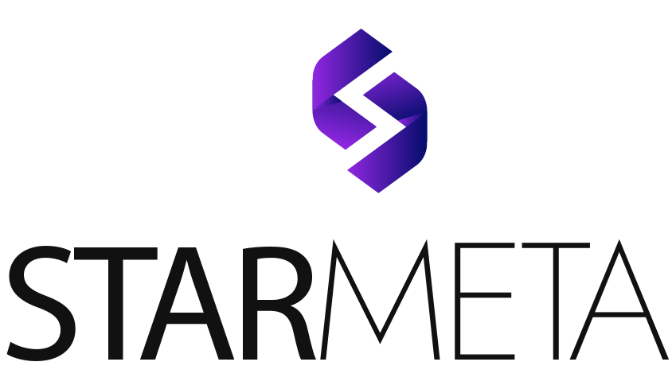

  

  

  
  
  
  

---

# 👋 Hello, I'm Pietro

Computer Science student at **FIAP** passionate about building solutions that combine **Data, Artificial Intelligence, Automation and Software Engineering**.

Currently working as a **Data Intern at Avenue** and previously as an **AI & Automation Intern at Starmeta**, developing intelligent systems, automations and data-driven solutions.

---

# 🎯 Professional Highlights

- 📊 Data Intern at Avenue
- 🤖 Former AI & Automation Intern at Starmeta
- 🎓 Computer Science Student at FIAP
- 🚀 Experience with Data, AI, Automation and Backend Development

---

# 💼 Experience

<table>
<tr>

<td align="center" width="50%">

### Avenue

**Data Intern**

📊 Data Analysis

📈 Business Intelligence

🗄 SQL & Databases

⚡ Data-Driven Solutions

</td>

<td align="center" width="50%">

### Starmeta

**AI & Automation Intern**

🤖 AI Agents

🔗 LangChain & LangGraph

⚙️ Workflow Automation

🚀 LLM Integrations

</td>

</tr>
</table>

---

# 🚀 Featured Projects

<table>

<tr>

<td width="50%">

## 🍽 ranGO!

Restaurant inventory and operational management platform.

### Technologies

JavaScript • HTML • CSS • MongoDB

</td>

<td width="50%">

## ☀️ GoodWe Challenge

AI-powered solar simulation and intelligent energy management solution.

### Technologies

Artificial Intelligence • Automation • Analytics

</td>

</tr>

<tr>

<td width="50%">

## 🌱 Motiva Challenge

Vegetation monitoring platform for highway concessionaires.

### Technologies

React • TypeScript • Data Analysis

</td>

<td width="50%">

## 🌍 GeoRelato

CLI application for disaster reporting with geospatial validation.

### Technologies

Python • Algorithms • Data Structures

</td>

</tr>

</table>

---

# 🛠 Tech Stack

### Languages

### Backend & Databases

### Infrastructure & Tools

---

# 🤖 AI & Automation

- LangChain
- LangGraph
- OpenAI API
- AI Agents
- RAG Architectures
- Prompt Engineering
- n8n
- REST APIs
- Webhooks
- Workflow Automation

---

# 📊 Data & Analytics

- SQL
- PostgreSQL
- Data Analysis
- Data Processing
- Data Modeling
- ETL Concepts
- Business Intelligence
- Data Visualization

---

# 📈 GitHub Stats

  
  
  

  

---

# 📬 Contact

---

  

